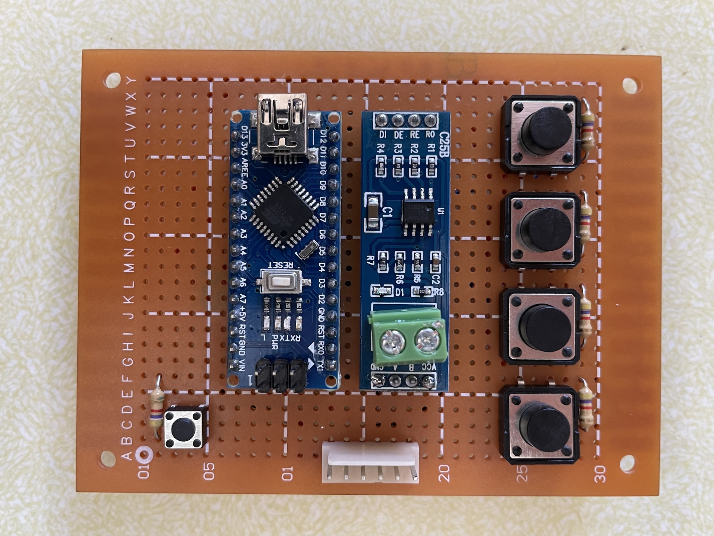

# BKM-10Rduino

BKM-10Rduino is an Arduino (natch) based alternative for the Sony BKM-10R control unit typically used with Sony broadcast monitors like the BVM-D20F1a/e/u.

## Why?

BVM and PVM CRTs are rather popular with retro gaming enthusiasts, but they are being priced out of reach for the average fan. I managed to rescue a BVM-D20F1A that was destined for e-waste. Of course it was missing the control unit and it was stuck on the SDI input. One spare Arduino Nano, a couple of components, and a lot of swearing later, I had something good enough to use the menus to change inputs and do basic setup. With the help of Martin (@skumlos), this evolved in to a universal IR based replacement.

## What's it do?

Allows the use of almost any IR remote you might have lying around to control any BVM compatible with the BKM-10R. It's configurable through a learning mode, so it's kind of like using a universal remote control, if you remember those from the late 90s. All the buttons on the BKM-10R are replicated, and all status LEDs are displayed on an OLED screen.

There's no problem assembling this on a breadboard, but there are KiCAD schematics, PCB designs and gerber files included if you'd like a more polished finised product.

## Warning

I'm not an electrical engineer. I don't know enough to know when I'm doing something stupid or dangerous. Goes without saying that there is absolutely no warranty; if your precious monitor explodes, I will be very sympathetic and sorry, but that's all. Proceed at your own risk.

If you want to build the PCB version, there are some SMT components, so a least a bit of soldering experience is highly recommended.

### Parts list
* Arduino NANO
* SOIC-14 full duplex RS485 transceiver; Analog Devices ADM3063EARZ-ND or similar
* TSOP343xx IR receiver module
* 60ohm SMT resistor
* 4x 1uF SMT capacitors
* DB9 socket of your choice

### Cable

The BVM end is just a standard DB9 connector, I used a 6 pin header on my prototype, but you can use what ever you want to connect to your controller. I sacrificed a short CAT-5 cable for mine.

The BKM-10R uses RS485 for communication, which is a differential signally communication protocol. Basically, TX from the Arduino is converted to a pair of lines +TXD and -TXD; same deal for RXD.

DB9 | J1
--- | --
Pin 1 | GND
Pin 2 | -TXD
Pin 3 | +RXD
Pin 4 | NC
Pin 5 | +5v
Pin 6 | NC
Pin 7 | +TXD
Pin 8 | -RXD
Pin 9 | NC

Don't mix up TXD and RXD otherwise you'll spend an afternoon wondering why it doesn't work.

## Thanks

I found the control codes on an anonymous [pastebin](https://pastebin.com/aTUWf33J), so must thank this unknown hero.
