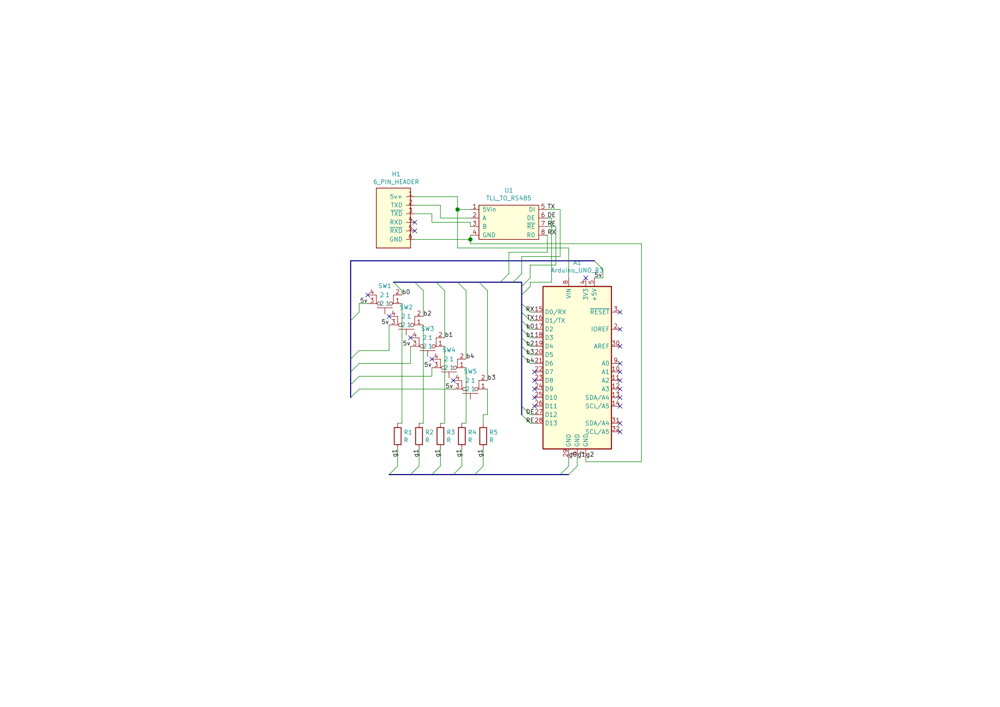

# BKM-10Rduino

BKM-10Rduino is an Arduino (natch) based alternative for the Sony BKM-10R control unit typically used with Sony broadcast monitors like the BVM-D20F1a/e/u.

## Why?

BVM and PVM CRTs are rather popular with retro gaming enthusiasts, but they are being priced out of reach for the average fan. I managed to rescue a BVM-D20F1A that was destined for e-waste. Of course it was missing the control unit and it was stuck on the SDI input. One spare Arduino Nano, a couple of components, and a lot of swearing later, I had something good enough to use the menus to change inputs and do basic setup.

## What's it do?

At the moment, just enough to be useful. Gives you a power, menu, enter and up/down buttons. Should be enough to get to all the important settings. Oh and it doesn't cost an arm and a kidney to put together. It's powered from the control port on the monitor so it's self contained and easy to use.

## Warning

I'm not an electrical engineer. I don't enough know enough to know when I'm doing something stupid or dangerous. Goes without saying that there is absolutely no promises and if your precious monitor explodes, I will be very sympathetic and sorry, but that's all. Proceed at your own risk.

While you could get away without soldering for this project, it's more that likely you'll need at least basic soldering skills.

## Setup

The basic hardware can be put together on a breadboard if you only need it as a stop-gap. Otherwise I've put it together on some prototyping board and also designed a PCB in KiCAD. I've never used KiCAD before now, so don't blame me if it doesn't work due to my stupidity. Constructive criticism very welcome though. I'll try and order a couple of PCBs for testing soon.

After that, just upload the arudino sketch, it's been tested on UNO and NANO boards so far, make yourself a cable and enjoy.

### Parts list
Arduino UNO, NANO, etc
5 tactile switches of your choice, design is based on 4 pin single pole switches
5 pull-down resistors, anything from 4-10k should be fine
MAX485 based TTL UART to RS485 Converter Module, like [this one](https://core-electronics.com.au/ttl-uart-to-rs485-converter-module.html)
Something to stick it all on

### Cable

The BVM end is just a standard DB9 connector, I used a 6 pin header on my prototype, but you can use what ever you want to connect to your controller. I sacrificed a short CAT-5 cable for mine.

The BKM-10R uses RS485 for communication, which is a differential signally communication protocol. Basically, TX from the Arduino is converted to a pair of line +TXD and -TXD. RXD is here for the future, when I might decide I want a status display.

Pin 1 -> GND (H1 pin 6)
Pin 2 -> -TXD (H1 pin 2)
Pin 3 -> +RXD (H1 pin 4 - unused)
Pin 4 -> GND (can be tied to 1)
Pin 5 -> +5v (H1 pin 1)
Pin 6 -> GND
Pin 7 -> +TXD
Pin 8 -> RXD-
Pin 9 -> GND

Don't mix up TXD and RXD otherwise you'll spend an afternoon wondering why it doesn't work.

## Thanks

I found the control codes on an anonymous [pastebin](https://pastebin.com/aTUWf33J), so must thank this unknown hero.
